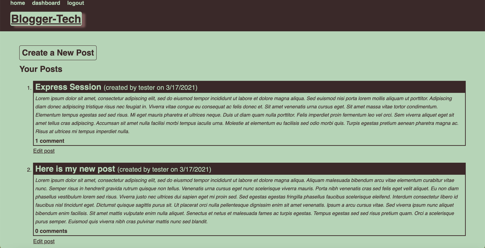

# Blogger-Tech 

## Description
  This application is a CMS-style blog site where developer in the tech world can publish articles, blog posts and thoughts and opinions.
  
* Users initially provide a username, email and password to create an account. 
* Navigation to the homepage presents the user with existing blog posts. 
* Clicking on either the title of the blog post or the comments takes the user to that blog post that includes the post title, creator's username, date the post was created as well as an option to leave a comment.
* If a comment is entered and saved then the post is updated to display the comment, the comment creator's name and the date it was created
* The dashboard option in the navigation takes the user to any blog posts the user has created and the option ao add a new blog post
* When the user chooses to edit any of their existing blog posts, they are able to delete or update their post
* The logout option allows the user to sign out
* Being idle on the page for more than a minute will automatically sign the user out of the site

## Table of Contents

* [Screenshots](#screenshots)
* [Installation](#installation)
* [Usage](#usage)
* [License](#license)

## Screenshots of web application 

## Installation
  Clone the repository to your terminal. Intall Node.js to your terminal. Run nmp install to install each of the packages listed in the package.json file.

## Usage
  This application's folder structure followed the Model-View-Controller paradigm. 
  
  It used the express-handlebars package to use Handlebars.js for Views, used the MySQL2 and Sequelize packages to connect to a MySQL database for the Models and create an Express.js API for the Controllers. It also used the dotenv package to use environment variables, the bcrypt package to has passwords and the express-session and connect-session-sequelize packages to add authentication.
  
## License  
  
Licensed under the The MIT License (the "License");
you may not use this file except in compliance with the License.
You may obtain a copy of the License at

(https://opensource.org/licenses/MIT)

Unless required by applicable law or agreed to in writing, software
distributed under the License is distributed on an "AS IS" BASIS,
WITHOUT WARRANTIES OR CONDITIONS OF ANY KIND, either express or implied.
See the License for the specific language governing permissions and
limitations under the License.
  
